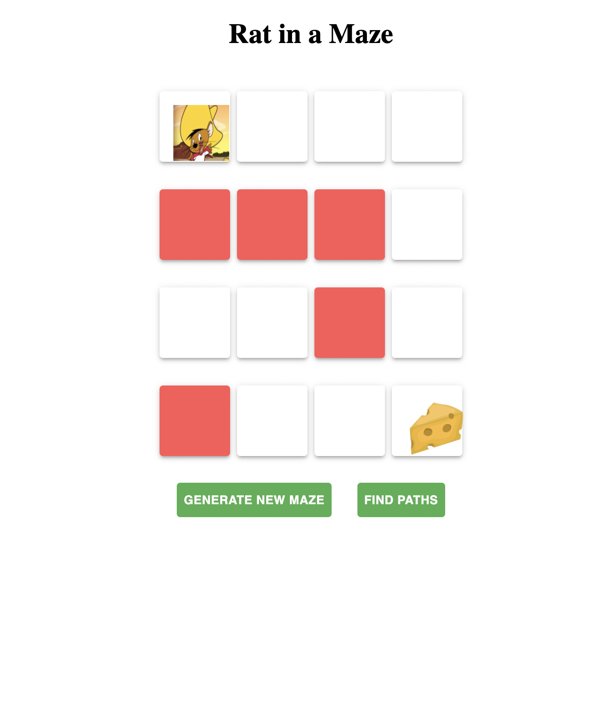

# Rat in Maze app:

## description:

- An application developped with React.js for the webdev program held by Business College Helsinki.
- Genereating a random maze and retrieving all the possible paths to the cheese.

## Used concepts:

- Passing Props from parent elements to children
- Defining methods in the class components and allow the app to render the states as the change.
- Passing methodes from one component to another.
- Manipulating the rendering using MaterialUI.
- Using Bactracking and Recursive algorithmes.

## Credits:

- Santosh Kalwar: https://github.com/kalwar

## App screenshots

